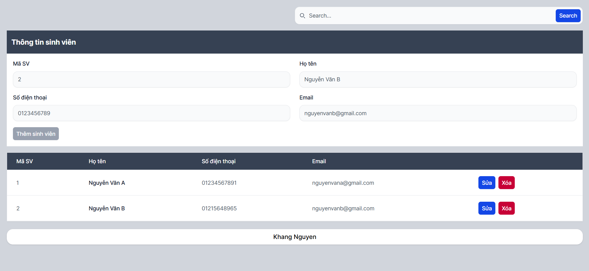

# React.js - Assignment 05 - React Form


<!-- TOC -->

- [React.js - Assignment 05 - React Form](#reactjs---assignment-05---react-form)
    - [Overview](#overview)
    - [Tech Stack](#tech-stack)
    - [Features](#features)
    - [Prerequisites](#prerequisites)
        - [Environment](#environment)
        - [Project Structure](#project-structure)
    - [Getting Started](#getting-started)
    - [Author](#author)

<!-- /TOC -->

## Overview

Đây là bài tập thực hành xây dựng UI với React.js và quản lý state với Redux, áp dụng việc quản lý sinh viên (CRUD)

This is an assignment about demonstration CRUD and validate form with React.js and Redux



## Tech Stack

- **React 19** + **Vite 8**
- **Tailwind CSS 4** + **Flowbite 4**
- **Redux Toolkit 2** + **React Redux 9**

## Features

- CRUD student
- Validate form
- Search student

## Prerequisites

### Environment

- Node.js
- Package manager: npm, yarn, or pnpm (repo có sẵn `pnpm-lock.yaml`)

### Project Structure

```text
./
│   .gitignore
│   eslint.config.js
│   index.html
│   package.json
│   pnpm-lock.yaml
│   README.md
│   vite.config.js
│
├───docs/
├───public/
│   └───images/
│
└───src
    │   App.jsx
    │   index.css
    │   main.jsx
    │
    ├───store/
    └───components/
```

## Getting Started

```bash
# Install dependencies
pnpm install
# npm install
# yarn install

# Start the development server
pnpm run dev
# npm run dev
# yarn run dev
```

The app will be available at `http://localhost:5173` by default.

## Author

Khang Nguyen
